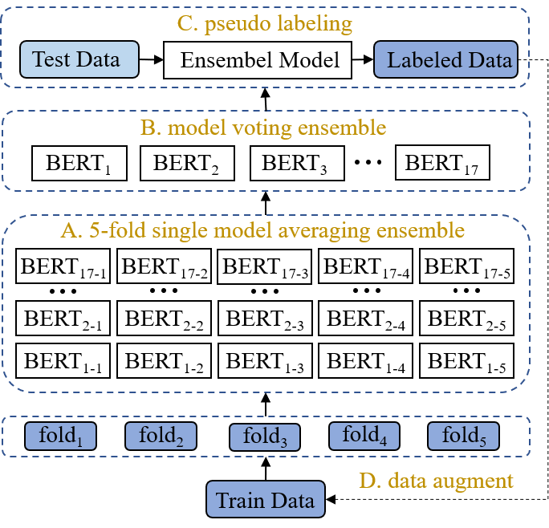
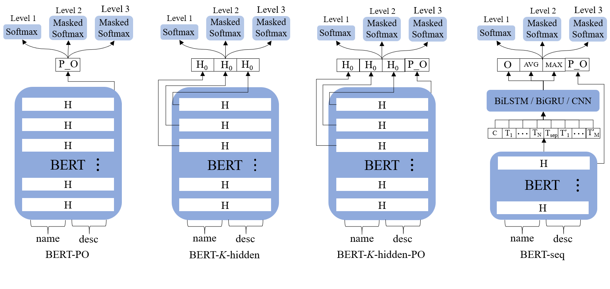
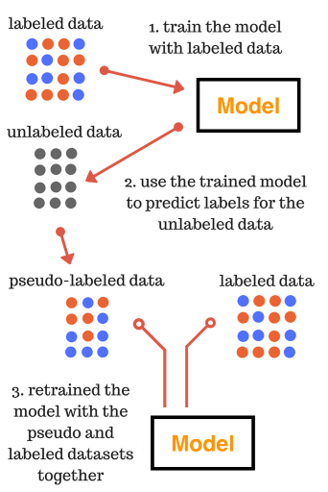

# iswc2020_prodcls
ISWC2020 Semantic Web Challenge - Product Classification Top1 Solution

## Solution

### Overall Framework


1. Train 17 different BERT base models with dynamic masked softmax
2. Adopt a two-level ensemble strategy to combine the single models
3. Utilize pseudo labeling for data augmentation

### Base Model Construction


- **BERT-PO** uses the pooler output of BERT as the product representation.
- **BERT-*K*-hidden** concatenates the first hidden state from the last $K$ hidden layers of BERT as the product representation.
- **BERT-*K*-hidden-PO** concatenates the first hidden state from the last $K$ hidden layers as well as the pooler output of BERT as the product representation.
- **BERT-seq** uses the hidden states from the last hidden layer of BERT as the input of another sequence layer, and then concatenates the pooler output of BERT, with the last hidden output as well as the max-pooling and mean-pooling over the hidden states of sequence layer, as the final product representation.

### Dynamic Masked Softmax

1. Devise a mask matrix for each sub-level based on the category hierarchy  
$$
   M^{l} \in\{0,1\}^{N^{l-1} * N^{l}}
$$
2. Adopt dynamic masked softmax to filter out the unrelated categories  
$$
P\left(y_{v}^{l} \mid s, \theta\right)=\frac{\exp \left(O_{v}^{l}\right) * M_{u, v}^{l}+\exp (-8)}{\sum_{v^{\prime}=1}^{N} \exp \left(O_{v^{\prime}}^{l}\right) * M_{u, v^{\prime}}^{l}+\exp (-8)}
$$

### Model Ensemble

1. Averaging ensemble to the single models with the same architecture but trained on different folds of data
2. Voting ensemble to 17 different single models

### Pseudo Labeling


## Experiment

### Environment Preparation
```shell script
pip install virtualenv
virtualenv tf2
source tf2/bin/activate
pip install -r requirements.txt
```

### Data Preparation

1. dataset  
Download the dataset below, put them in the `raw_data` dir:
    - [train.json](https://drive.google.com/open?id=1WirDfqGvBYgly27egMx6Om9QeXO6B2UX)
    - [validation.json](https://drive.google.com/open?id=1WirDfqGvBYgly27egMx6Om9QeXO6B2UX)
    - [test_public.json](https://bit.ly/2Yr0dkb)
    - [task2_testset_with_labels.json](https://drive.google.com/file/d/1RI27LIp_s-LP10eKKNWz914bapfRhOJl/view?usp=sharing)


2. pre-trained BERT model
Download the files of BERT model, put them in the `raw_data/embeddings/bert-base-uncased` dir:
    - [bert-base-uncased-vocab.txt](https://s3.amazonaws.com/models.huggingface.co/bert/bert-base-uncased-vocab.txt)
    - [bert-base-uncased-config.json](https://s3.amazonaws.com/models.huggingface.co/bert/bert-base-uncased-config.json)
    - [bert-base-uncased-tf_model.h5](https://cdn.huggingface.co/bert-base-uncased-tf_model.h5)
    

### Pre-processing
```shell script
python preprocess.py
```

### (1st) Training
```shell script
python train.py
```

### (1st) Ensemble and Pseudo Labeling
```shell script
python ensemble.py
```

### (1st) Training
```shell script
python train.py
```

### (2nd) Re-training with Pseudo Labels
```shell script
python train_pseudo_label.py
```

### (2nd) Re-ensemble
```shell script
python ensemble_pseudo_label.py
```